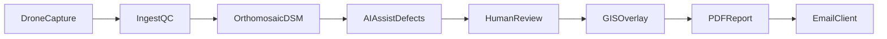

# Report Pipeline — Roof Intelligence

**Agent:** `@spatial-data-engineer`

---

## Pipeline overview



---

## Folder structure (per job)

```
SF-YYYY-####/
  raw/           # originals
  project/       # photogrammetry
  exports/       # ortho, dsm, geojson
  report/        # PDF, thumbnails
  qa/            # review notes
```

---

## Processing steps

1. **Ingest QC** — blur, overlap, RTK fix quality
2. **Orthomosaic + DSM** — export GeoTIFF (GDA2020)
3. **AI assist** — draft defects per `DEFECT_TAXONOMY.md`
4. **Human review** — mandatory sign-off on critical items
5. **GIS overlay** — export static map image for PDF (defer live web map)
6. **PDF** — use `branding-kit/templates/reports/` HTML → print PDF
7. **Delivery** — email + archive

---

## PDF sections

1. Cover (address, date, report ID)
2. Executive summary + condition index
3. Defect register table
4. Annotated map
5. Methodology (drone, RTK, AI-assisted + human review)
6. Limitations disclaimer
7. Recommendations

---

## QA gate

- [ ] All critical defects reviewed by second person
- [ ] Address matches booking
- [ ] No placeholder illustrative data in production PDF
- [ ] Disclaimer present

---

## Tools (configure per ops)

| Step | Tool options |
|------|----------------|
| Photogrammetry | Metashape / Pix4D / ODM |
| GIS | QGIS |
| PDF | HTML template → Chrome print |

---

## SLA

Target: PDF delivered within **24 hours** of capture. Log actual times in `docs/launch/METRICS_LOG.md`.
